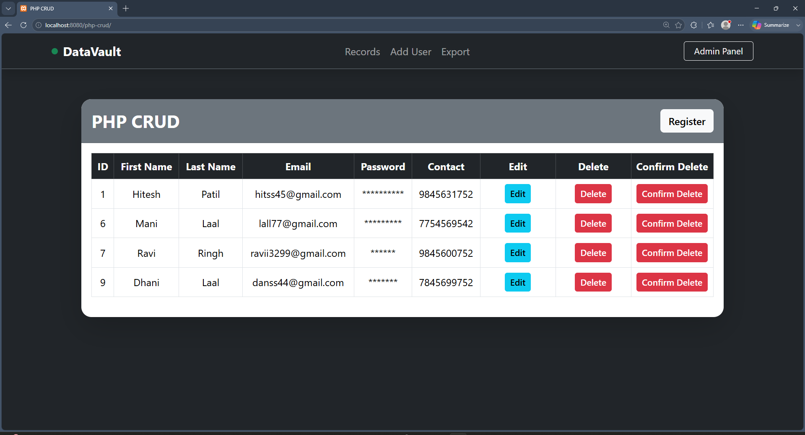
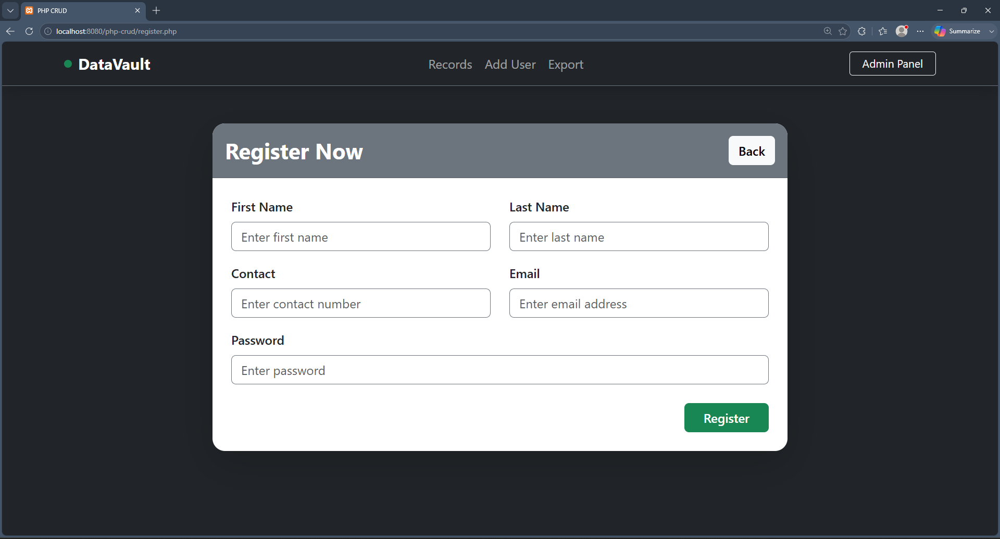

# 🚀 PHP CRUD Application

A modern and responsive **PHP CRUD (Create, Read, Update, Delete)** application built using **Core PHP**, **MySQL**, **Bootstrap 5**, and **SweetAlert2**. This project allows users to manage records efficiently and also provides a **CSV Export** feature for downloading all stored data.

---

## 📌 Features

- ✅ Create New User
- ✅ View All Users
- ✅ Update Existing User
- ✅ Delete User
- ✅ Export Records to CSV
- ✅ SweetAlert2 Success & Warning Messages
- ✅ Responsive Bootstrap 5 User Interface
- ✅ MySQL Database Integration
- ✅ Clean Project Structure using Includes
- ✅ Git & GitHub Version Control

---

## 🛠️ Tech Stack

| Technology | Usage |
|------------|-------|
| PHP | Backend Development |
| MySQL | Database |
| Bootstrap 5 | Responsive UI |
| HTML5 | Structure |
| CSS3 | Styling |
| JavaScript | Client-side Functionality |
| jQuery | DOM Manipulation |
| SweetAlert2 | Beautiful Alert Messages |
| XAMPP | Local Development Environment |
| Git & GitHub | Version Control |

---

## 📁 Project Structure

```
php-crud/
│
├── includes/
│   ├── header.php
│   └── footer.php
│
├── javascript/
│   ├── jquery.js
│   └── sweetalert.js
│
├── code.php
├── dbconfig.php
├── export.php
├── index.php
├── register.php
├── register-edit.php
├── README.md
└── .gitignore
```

---

## ⚙️ Installation Guide

### 1️⃣ Clone Repository

```bash
git clone https://github.com/yashmahajancd/php-crud.git
```

### 2️⃣ Move Project

Copy the project into:

```
C:\xampp\htdocs\
```

### 3️⃣ Start XAMPP

Start:

- Apache
- MySQL

### 4️⃣ Create Database

Open:

```
http://localhost/phpmyadmin
```

Create a database:

```
php_crud
```

Create a table named:

```
register
```

Or import the provided SQL file (recommended if included).

### 5️⃣ Run Project

Open:

```
http://localhost/php-crud
```

---

## 📊 CSV Export

The application allows exporting all user records directly into a **CSV file**.

Features:

- One-click Export
- Automatically Downloads
- Compatible with Microsoft Excel
- UTF-8 Encoding Support

---

## 🎨 UI Features

- Responsive Navbar
- Bootstrap Cards
- Responsive Table
- SweetAlert Success Messages
- SweetAlert Warning Messages
- Clean Layout

---

## 📷 Screenshots

### Home Page




### Registration Form



---

## 📚 Learning Objectives

This project demonstrates:

- PHP CRUD Operations
- MySQL Connectivity
- Form Handling
- Database Management
- CSV File Export
- Bootstrap UI Development
- SweetAlert Integration
- Modular PHP using Includes
- Git & GitHub Workflow

---

## 🤝 Contributing

Contributions, suggestions, and improvements are always welcome.

Fork the repository and submit a Pull Request.

---

## 👨‍💻 Author

**Yash Mahajan**

Surat, Gujarat, India

GitHub: https://github.com/yashmahajancd

---

## ⭐ Support

If you found this project useful, consider giving it a **⭐ Star** on GitHub.